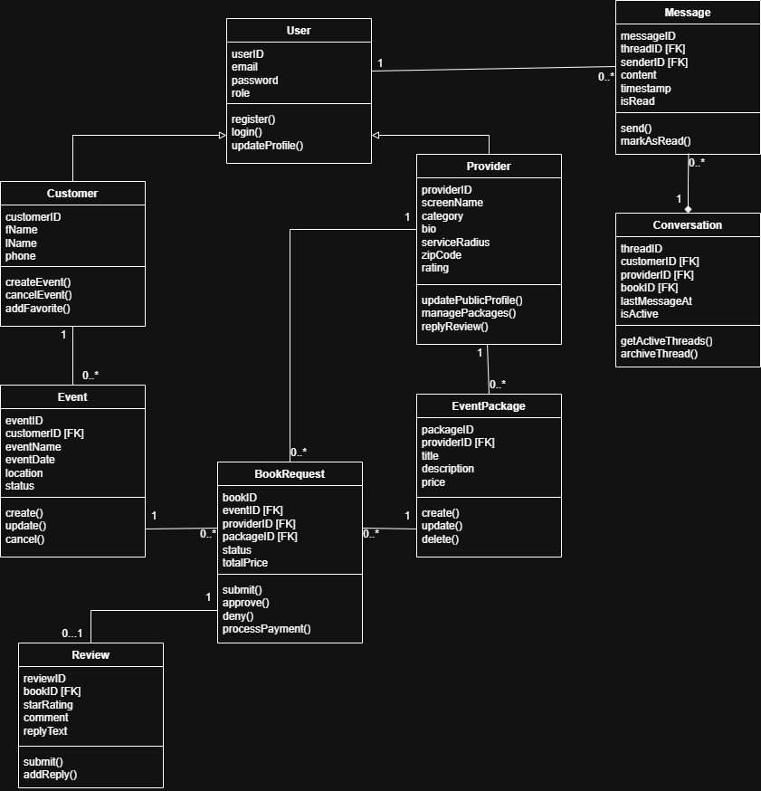

# EventSpark - Backend API Documentation

**Version:** 1.0
**Last Updated:** March 2026
**Base URL:** 'http://localhost:8080/api'

---

## Table of Contents

1. [Overview](#1-overview)
2. [User Roles](#2-user-roles)
3. [UML Class Diagram](#3-uml-class-diagram)
4. [API Endpoints](#4-api-endpoints)
    - [Customer Management](#customer-management)
    - [Service Package Management](#service-package-management)
    - [Provider Management](#provider-management)
    - [Event Management](#event-management)
    - [Book Request Management](#book-request-management)
    - [Review Management](#review-management)
    - [Messaging & Conversations](#messaging--conversations)
5. [Use Case Mapping](#5-use-case-mapping)

---
## 1. Overview
The EventSpark Backend API provides a RESTful interface for a two-sided marketplace connecting event organizers with professional talent. It manages: 

- **User Accounts**: Customer (Event Organizers) and Provider (Talent) roles.
- **Service Packages**: Specific service bundles offered by providers with pricing and descriptions.
- **Book Requests**: Scheduled agreements and transactions linking a Customer's event to a Provider's package.
- **Events**: Allow Customer to create events in order to easily request a booking/package
- **Reviews**: Customer feedback on provider performance and provider replies.
- **Conversations & Messages**: Direct messaging threads between Customers and Providers for event coordination.

---
## 2. User Roles
The API supports two primary user roles based on the `UserRole` Enum:

| Role | Description | Primary Responsibilities |
|------|-------------|-------------------------|
| **CUSTOMER** | Event Organizer | Browse services, submit booking requests, manage events, write reviews, follow providers. |
| **PROVIDER** | Service Provider/Talent | Create packages, manage availability, approve/deny bookings, reply to reviews, upload gallery media. |

---
## 3. UML Class Diagram


---
## 4. API Endpoints
**Note:** Users are created through role-specific endpoints (`/customers`, `/providers`), not through a generic `/users` endpoint. This ensures proper role assignment and role-specific attributes.

### Customer Management
#### Create Customer
**Endpoint:** `POST /customers`
**Use Case:** US-CUST-001 (Profiles)
**Description:** Create a new customer account with profile information.

```http
POST /customers
Content-Type: application/json

{
  "email": "jmayas@example.com",
  "passwordHash": "hashed_password",
  "role": "CUSTOMER",
  "status": "ACTIVE",
  "firstName": "Jeremy",
  "lastName": "Mayas",
  "phone": "555-0192"
}
```

**Response:**
```json
{
"id": 1,
  "email": "jeremy@example.com",
  "role": "CUSTOMER",
  "status": "ACTIVE",
  "firstName": "Jeremy",
  "lastName": "Mayas",
  "phone": "555-0192",
  "notificationsEnabled": true,
  "createdAt": "2026-03-23T15:30:00",
  "updatedAt": "2026-03-23T15:30:00"
}
```

**Status Code:** `201 Created`

---

#### Update Customer Profile & Preferences
**Endpoint:** `PUT /customers/{id}`
**Use Case:** US-CUST-001 (Profiles), US-CUST-005 (Follow providers), US-CUST-008 (Enable notifications), US-CUST-009 (Filter notifications)
**Description:** Update profile details, follow providers, or toggle notification preferences

```http
PUT /customers/1
Content-Type: application/json

{
    "firstName": "Jeremy",
    "phone": "555-9999",
    "notificationsEnabled": false
}
```

**Response:** Updated customer object

**Status Code:** `200 OK` or `404 Not Found`

---

#### Delete Customer
**Endpoint:** `DELETE /customers/{id}`
**Use Case:** Account deletion
**Description:** Delete customer account.

```http
DELETE /customers/1
```

**Status Code:** `204 No Content` or `404 Not Found`

---

#### Get All Customers
**Endpoint:** `GET /customers`
**Use Case:** User management
**Description:** Retrieve all customer accounts.

```http
GET /customers
```

**Status Code:** `200 OK`

---

#### Get Customer by ID
**Endpoint:** `GET /customers/{id}`
**Use Case:** US-CUST-001 (Profiles)
**Description:** Retrieve specific customer by ID.

**Status Code:** `200 OK` or `404 Not Found`

---

### Service Package Management

####Create Service Package
**Endpoint:** `POST /packages`
**Use Case:** US-HOST-002 (Create Event Packages)
**Description:** Provider creates a new service bundle.

```http
POST /packages
Content-Type: application/json

{
  "provider": { "id": 2 },
  "title": "Basic Lighting Set",
  "description": "2 hours of ambient lighting and setup.",
  "price": 250.0,
  "category": "DECORATOR",
  "status": "ACTIVE"
}
```

**Response:** Created ServicePackage object

**Status Code:** `200 Created`

---

#### Browse All Packages
**Endpoint:** `GET /packages`
**Use Case:** US-CUST-002 (Browse Events), US-CUST-003 (Browse Events by Activity)
**Description:** Search for all available service bundles.

**Parameters:** `status` ACTIVE, INACTIVE / `category` MUSIC, ARTIST, DECORATOR, OTHER

**Status Code:** `200 OK`

---

#### Get Packages by Provider ID
**Endpoint:** `GET /packages/provider/{providerId}`
**Use Case:** US-CUST-004 (View details)
**Description:** Retrieve all packages offered by a specific provider.

**Status Code:** `200 OK`

---

### Provider Management
#### Create Provider
**Endpoint:** `POST /providers`
**Use Case:** US-HOST-001 (Create/Manage Profile)
**Description:** Create a new service provider account.

```http
POST /providers
Content-Type: application/json

{
  "email": "levi@example.com",
  "passwordHash": "hashed_password",
  "role": "PROVIDER",
  "status": "ACTIVE",
  "name": "Levi's Lighting",
  "category": "DECORATOR",
  "bio": "Professional event lighting services.",
  "serviceRadius": 50,
  "zipCode": "27260"
}
```

**Reponse:**
```json
{
    "id": 2,
    "email": "levi@example.com",
    "role": "PROVIDER",
    "status": "ACTIVE",
    "name": "Levi's Lighting",
    "category": "DECORATOR",
    "bio": "Professional event lighting services.",
    "serviceRadius": 50,
    "zipCode": "27260",
    "rating": null,
    "createdAt": "2026-03-23T15:30:00",
    "updatedAt": "2026-03-23T15:30:00"
}
```

**Status Code:** `201 Created`

---

#### Get Provider by ID
**Endpoint:** `GET /providers/{id}`
**Use Case:** US-CUST-004 (View details)
**Description:** Retrieve specific provider details

**Status Code:** `200 OK` or `404 Not Found`

---

#### Get Providers by Category
**Endpoint:** `GET /providers/category/{category}`
**Use Case:** US-CUST-003 (Browse events by activity)
**Description:** Filter providers by their service category

**Status Code:** `200 OK`

---

#### Update Provider
**Endpoint:** `PUT /providers/{id}`
**Use Case:** US-HOST-001 (Manage Profile), US-HOST-003 (Manage Calendar)
**Description:** Update provider bio, radius, or blocked dates.

```http
PUT /providers/2
Content-Type: application/json

{
  "bio": "Professional stage setup.",
  "serviceRadius": 100,
  "blockedDates": ["2026-04-10"]
}
```

**Reponse:** Updated Provider object.

**Status Code:** `200 OK` or `404 Not Found`

---

#### View Provider Analytics
**Endpoint:** `GET /providers/{id}/analytics`
**Use Case:** US-HOST-009 (Track Performance)
**Description:** Retrieve profile engagement metrics.

**Response:** `Profile Views: X, Package Clicks: Y`

**Status Code:** `200 OK`

---

#### View Provider Gallery
**Endpoint:** `GET /providers/{id}/gallery`
**Use Case:** US-HOST-006 (Media Gallery)
**Description:** View media on provider profile/upload media

**Response:** Provider object with updated `imageURLS` list

**Status Code:** `200 OK`

---

#### Update Travel Radius
**Endpoint:** `PUT /providers/{id}`
**Use Case:** US-HOST-007 (Travel Radius)
**Description:** Update the maximum distance a provider is willing to travel for an event to ensure they only receive realistic booking requests.

```http
HTTP
PUT /api/providers/2
Content-Type: application/json

{
  "serviceRadius": 75
}
```

**Response:** 
```
json
{
  "id": 2,
  "name": "Levi's Lighting",
  "serviceRadius": 75,
  "zipCode": "27260",
  "updatedAt": "2026-03-23T16:45:00"
}
```

**Status Code:** `200 OK` or `404 Not Found`

---

#### Service Category Tagging
**Endpoint:** `PUT /providers/{id}`
**Use Case:** US-HOST-010 (Service Category Tag)
**Description:** Allows a provider to tag their profile with specific genres or categories (e.g., Wedding DJ, Painter) to ensure they appear in relevant filtered searches

```http
PUT /api/providers/2
Content-Type: application/json

{
  "category": "WEDDING_PHOTOGRAPHER"
}
```

**Response:**
```
json
{
  "id": 2,
  "name": "Levi's Lighting",
  "category": "WEDDING_PHOTOGRAPHER",
  "updatedAt": "2026-03-23T17:05:00"
}
```
**Status Code:** `200 OK` or `404 Not Found`

---

### Event Management
#### Create Event
**Endpoint:** `POST /events`
**Use Case:** US-CUST-002 (Browse events)
**Description:** Customer creates an event to host bookings.

```http
POST /events
Content-Type: application/json

{
  "customer": { "id": 1 },
  "eventName": "Graduation",
  "eventDate": "2026-12-01T18:00:00",
  "location": "Greensboro, NC",
  "status": "PLANNING"
}

```

**Response:** Full Event object including ID

**Status Code:** `201 Created`

---

#### Get Events by Customer ID
**Endpoint:** `GET /events/customer/{customerId}`
**Use Case:** US-CUST-001 (Profiles)
**Description:** Retrieve all events organized by a specific customer.

**Status Code:** `200 OK`

---

### Booking Request Management
#### Create Booking Request
**Endpoint:** `POST /book-requests`
**Use Case:** US-CUST-004 (Book service)
**Description:** Customer requests a service for an event.

```http
POST /book-requests
Content-Type: application/json

{
  "event": { "id": 1 },
  "provider": { "id": 2 },
  "eventPackages": [{ "id": 10 }],
  "status": "PENDING",
  "totalPrice": 250.0
}
```

**Response:** Pending BookRequest object

**Status Code:** `201 Created`

---

#### Update Booking Status
**Endpoint:** `PUT /book-requests/{id}`
**Use Case:** US-HOST-004 (Process Requests), US-CUST-010 (Cancel Service), US-HOst-003 (Manage booking calendar)
**Description:** Approve, deny, or cancel a booking.

```http
PUT /book-requests/101
Content-Type: application/json

{
  "status": "APPROVED"
}
```

**Status Code:** `200 OK` or `404 Not Found`

---

#### Update Booking Status
**Endpoint:** `GET /book-requests/provider/{providerId}`
**Use Case:** US-HOST-004 (View Inbox)
**Description:** Retrieve all requests for a specific provider.

**Status Code:** `200 OK`

---

### Review Management
#### Create Review
**Endpoint:** `POST /reviews`
**Use Case:** US-CUST-006 (Write a review)
**Description:** Leave feedback after a completed booking.

```http
POST /reviews
Content-Type: application/json

{
  "bookRequest": { "id": 101 },
  "starRating": 5,
  "comment": "Excellent lighting, really set the mood!"
}
```

**Status Code:** `201 Created`

---

#### Get Reviews by Event ID
**Endpoint:** `GET /reviews/event/{eventId}`
**Use Case:** US-CUST-007 (Read reviews)
**Description:** Retrieve all reviews associated with a specific event.

**Status Code:** `200 OK`

#### Reply to Review
**Endpoint:** `PUT /reviews/{id}`
**Use Case:** US-HOST-005 (Respond to Feedback)
**Description:** Provider posts a reply to a review.

```http
PUT /reviews/201
Content-Type: application/json

{
  "replyText": "Thank you! It was a pleasure working with you."
}
```

***Status Code:** `200 OK`

---

### Messaging & Conversations
#### Send Message
**Endpoint:** `POST /messages`
**Use Case:** US-HOST-008 (Direct Message)
**Description:** Send a message in a conversation thread.

```http
POST /api/messages
Content-Type: application/json

{
  "thread": { "id": 1 },
  "sender": { "id": 2 },
  "content": "What is the venue's outlet situation?"
}
```

**Status Code:** `201 Created`

#### Get Thread History
**Endpoint:** `GET /messages/thread/{threadId}`
**Use Case:** US-HOST-008 (Direct Message)
**Description:** Load chat history for a thread.

**Status Code:** `200 OK`


---

## 5. Use Case Mapping
The following table ensures every requirement from the **EventSpark SRS** is satisfied by the API.
### Customer Use Cases (US-CUST)
| Use Case | Description | API Endpoint(s) |
|----------|-------------|-----------------|
| **US-CUST-001** | Profiles | `POST /customers`, `PUT /customers/{id}` |
| **US-CUST-002** | Browse events | `GET /packages`, `GET /providers` |
| **US-CUST-003** | Browse by activity | `GET /providers/category/{category}` |
| **US-CUST-004** | View details | `GET /providers/{id}`, `GET /packages/provider/{id}` |
| **US-CUST-005** | Follow providers | `PUT /customers/{id}` |
| **US-CUST-006** | Write a review | `POST /reviews` |
| **US-CUST-007** | Read reviews | `GET /reviews/event/{id}` |
| **US-CUST-008** | Enable notifications | `PUT /customers/{id}` |
| **US-CUST-009** | Filter notifications | `PUT /customers/{id}` |
| **US-CUST-010** | Cancel Service | `PUT /book-requests/{id}` |

### Provider Use Cases (US-HOST)
| Use Case | Description | API Endpoint(s) |
|----------|-------------|-----------------|
| **US-HOST-001** | Manage Profile | `POST /providers`, `PUT /providers/{id}` |
| **US-HOST-002** | Create Packages | `POST /packages`, `PUT /packages/{id}` |
| **US-HOST-003** | Booking Calendar | `PUT /providers/{id}` |
| **US-HOST-004** | Process Requests | `GET /book-requests/provider/{id}`, `PUT /book-requests/{id}` |
| **US-HOST-005** | Respond to Feedback | `PUT /reviews/{id}` |
| **US-HOST-006** | Media Gallery | `POST /providers/{id}/gallery` |
| **US-HOST-007** | Travel Radius | `PUT /providers/{id}` |
| **US-HOST-008** | Direct Message | `POST /messages`, `GET /messages/thread/{id}` |
| **US-HOST-009** | Track Analytics | `GET /providers/{id}/analytics` |
| **US-HOST-010** | Category Tagging | `GET /providers/category/{category}` |
